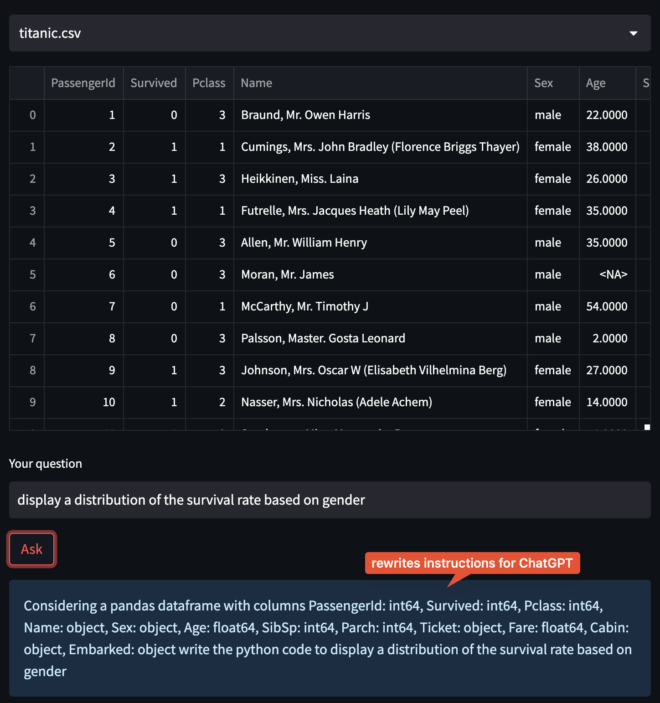
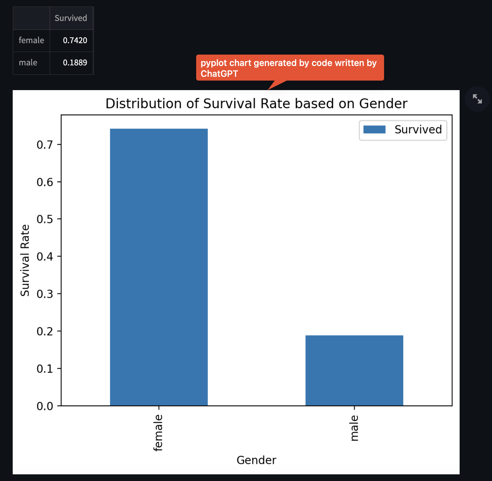

# Chat GPT for data visualisation - WIP

This tool is intended to generate prompts for ChatGPT given two things: 1. an arbitrary dataset and 2. a question provided by the user. It adjusts the response from ChatGPT API and runs the code automatically to generate a matplotlib chart (or whatever visual you asked for). The goal is the ability to perform EDA for a dataset by stating a question using words. Contributions are welcome. It can be useful for bootstraping EDA tasks but it is still WIP.


For example by selecting the titanic dataset and providing the question: `generate a correlation matrix for the survivors based on the fare paid for the ticket`.

It will generate the ChatGPT prompt: `Considering a pandas dataframe with columns PassengerId: int64, Survived: int64, Pclass: int64, Name: object, Sex: object, Age: float64, SibSp: int64, Parch: int64, Ticket: object, Fare: float64, Cabin: object, Embarked: object write the python code to display a distribution of the survival rate based on gender`. Please note that the column names and types are extracted automaticaly.

ChatGPT will respond with:

```python
import pandas as pd
import matplotlib.pyplot as plt

# read in pandas dataframe
pd.read_csv("data.csv")

# create a new dataframe with gender and survival rate
gender_survival = df[['Sex', 'Survived']]

# calculate the survival rate for each gender
gender_survival_rate = gender_survival.groupby('Sex').mean()

# plot the survival rate
gender_survival_rate.plot(kind='bar')
plt.title('Distribution of Survival Rate based on Gender')
plt.xlabel('Gender')
plt.ylabel('Survival Rate')
plt.show()
```

This will than be adjusted so that it can run for example by replacing `pd.read_csv("data.csv")` by `pd.read_csv("titanic.csv")`

and finally we will execute the code. If there is no error we will see the pyplot chart. If we have an error, we will have the ability to adjust the code ourselves and run ti again.

# Example




## Future improvements

ChatGPT is awesome at generating code but fine tuning is still needed per the [OpenAI docs](https://beta.openai.com/docs/guides/fine-tuning).
However even if the code doesn't run without modifications it will be able to generate useful code that can act as the starting point which can be copied into a jupyter notebook.


## Set up

```
echo "OPENAI_API_KEY=your_api_key" > secrets.env
make build # only needed the first time
make run
```

## Security warning

It uses an unsafe way of running python code so best to just run this locally or in a safe environment. Unfortunatelly creating a [safe sandbox environment for Python execution is non trivial](https://stackoverflow.com/questions/3068139/how-can-i-sandbox-python-in-pure-python). Instead of trying to create the sandbox environment inside the application it might work best to do it at the infrastructure level by spinning off worker nodes that execute the unsafe code (using Kubernetes for example).

## OpenAI API throttling

As OpenAI starts rate limiting and throttling access to their API I will try adding support for other LLMs (especially the ones that are opensource such as [LangChain](https://huggingface.co/spaces/hwchase17/chat-langchain) and we can run locally on a GPU - although you will need a sufficiently large one).
